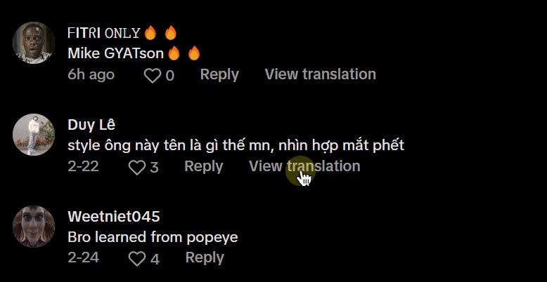

# TikTok Comment Translator

TikTok Comment Translator is a Chrome extension that adds a translate button to TikTok comments, allowing users to translate comments into their preferred language.

## Features

- Translate TikTok comments into multiple languages.
- Supports languages including Vietnamese, English, Chinese, Hindi, Spanish, and French.
- Automatically detects the source language and translates it to the target language.
- Saves the selected target language in Chrome's storage for future use.

## Installation

1. Clone or download this repository.
2. Open Chrome and navigate to `chrome://extensions/`.
3. Enable "Developer mode" by toggling the switch in the top right corner.
4. Click "Load unpacked" and select the folder where you downloaded or cloned this repository.

## Usage

1. Click the extension icon in the Chrome toolbar.
2. Select your preferred target language from the dropdown menu (default is Vietnamese).

3. Refresh the TikTok page to apply the changes.
4. Click the "View Translation" button that appears next to comments to translate them.

## Development

### File Structure

- `popup/popup.html`: HTML file for the extension's popup interface.
- `popup/popup.js`: JavaScript file to handle the popup's functionality.
- `content.js`: Content script that adds translate buttons to TikTok comments.
- `manifest.json`: Manifest file defining the extension's metadata and permissions.

### Adding a New Language

To add support for a new language:
1. Update the `BUTTON_TEXT_MAP` object in `content.js` with the translation texts for the new language.
2. Add the new language option in `popup.html`.

## License

This project is licensed under the MIT License. See the [LICENSE](LICENSE) file for details.

## Credits

- Developed by Nguyen Trong Duc (DuckCIT) © 2025
- Uses Google Translate API for translations

## Contributions

You are free to develop based on this project, but please credit the original author. Your respect for the original work is appreciated. Please open an issue or submit a pull request on GitHub.

## Contact

If you have any questions or feedback, please contact me at duckcitvn@gmail.com.