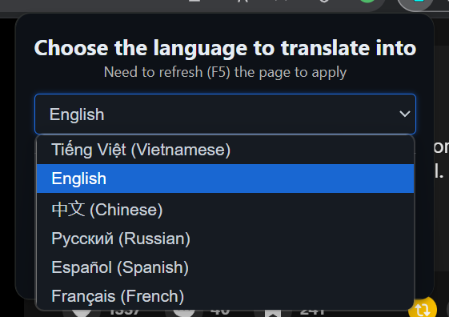

# TikTok Comment Translator

TikTok Comment Translator là một tiện ích mở rộng cho Chrome, thêm nút dịch vào các bình luận trên TikTok, cho phép người dùng dịch bình luận sang ngôn ngữ ưa thích của họ.

## Tính năng

- Dịch bình luận TikTok sang nhiều ngôn ngữ.
- Hỗ trợ các ngôn ngữ bao gồm Tiếng Việt, Tiếng Anh, Tiếng Trung, Tiếng Hindi, Tiếng Tây Ban Nha và Tiếng Pháp.
- Tự động phát hiện ngôn ngữ nguồn và dịch sang ngôn ngữ đích.
- Lưu ngôn ngữ đích đã chọn trong bộ nhớ của Chrome để sử dụng sau này.

## Cài đặt

1. Clone hoặc tải về repository này.
2. Mở Chrome và điều hướng đến `chrome://extensions/`.
3. Bật "Chế độ nhà phát triển" bằng cách bật công tắc ở góc trên bên phải.
4. Nhấp vào "Tải tiện ích đã giải nén" và chọn thư mục nơi bạn đã tải về hoặc clone repository này.

## Sử dụng

1. Nhấp vào biểu tượng tiện ích trong thanh công cụ của Chrome.
2. Chọn ngôn ngữ đích ưa thích của bạn từ menu thả xuống (mặc định là tiếng Việt).

3. Làm mới trang TikTok để áp dụng thay đổi.
4. Nhấp vào nút "Xem bản dịch" xuất hiện bên cạnh các bình luận để dịch chúng.

## Phát triển

### Cấu trúc tệp

- `popup/popup.html`: Tệp HTML cho giao diện popup của tiện ích.
- `popup/popup.js`: Tệp JavaScript để xử lý chức năng của popup.
- `content.js`: Tệp script nội dung thêm các nút dịch vào bình luận TikTok.
- `manifest.json`: Tệp manifest định nghĩa metadata và quyền của tiện ích.

### Thêm ngôn ngữ mới

Để thêm hỗ trợ cho một ngôn ngữ mới:
1. Cập nhật đối tượng `BUTTON_TEXT_MAP` trong `content.js` với các văn bản dịch của ngôn ngữ mới.
2. Thêm tùy chọn ngôn ngữ mới trong `popup.html`.

## Giấy phép

Dự án này được cấp phép theo Giấy phép MIT. Xem tệp [LICENSE](LICENSE) để biết chi tiết.

## Ghi công

- Phát triển bởi Nguyen Trong Duc (DuckCIT) © 2025
- Sử dụng Google Translate API để dịch

## Đóng góp

Bạn có thể tự do phát triển dựa trên dự án này, nhưng vui lòng ghi nhận tác giả gốc. Sự tôn trọng của bạn dành cho tác phẩm gốc được trân trọng. Vui lòng mở một issue hoặc gửi một pull request trên GitHub.

## Liên hệ

Nếu có bất kỳ câu hỏi hoặc phản hồi nào, vui lòng liên hệ với tôi tại duckcitvn@gmail.com.